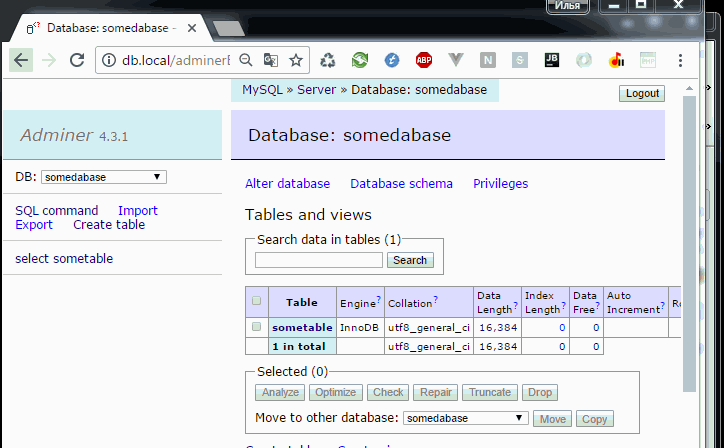

AdminerTsvToSql - TSV to SQL plugin for Adminer
===================

`AdminerTsvToSql` is a **plugin for [Adminer database tool](http://www.adminer.org/)** that allows to insert data directly from Excel/OpenOffice/LibreOffice/etc using clipboard by automatically converting clipboard TSV (tab separated values) to SQL INSERT query.
This is much more useful than saving and uploading CSV files.

Allows copying/pasting TSV table data (from Excel, LibreOffice, etc) into Adminer SQL query field;
Automatically detects TSV format and converts data into SQL query.
First row should contain column names.


   
Plugin for Adminer database tool (http://www.adminer.org/).
   
## Usage
Select and copy cells from Excel/OpenOffice/LibreOffice/etc
Paste to SQL command field
Change table name
Profit!

  
# Installation

1. [Download](http://www.adminer.org/#download) and install Adminer tool

2. Create plugins folder next to `adminer.php`

3. [Download `plugins.php`](https://raw.githubusercontent.com/vrana/adminer/master/plugins/plugin.php), this file is needed to load plugins; and place it into plugins folder

4. [Download `AdminerTsvToSql.php`](https://github.com/Rastishka/AdminerTsvToSql/blob/master/AdminerTsvToSql.php) and place it into plugins folder

	File structure will be:
	```
	- adminer.php
	- plugins
	    - plugin.php
		- adminer-tables_fuzzy_search.php
		- ... (other plugins you've already installed)
	```

5. Edit or create `index.php` file next to `adminer.php` and [configure plugins](http://www.adminer.org/plugins/#use) and add `new AdminerTsvToSql()` to $plugins array :

```php
<?php

	function adminer_object()
	{
		// required to run any plugin
		include_once "./plugins/plugin.php";

		// autoloader
		foreach (glob("plugins/*.php") as $filename) {
			include_once "./$filename";
		}

		$plugins = array(
			// specify enabled plugins here
			new AdminerTsvToSql(),
		);

		return new AdminerPlugin($plugins);
	}

	// include original Adminer or Adminer Editor
	include "./adminer.php";
```

Final file structure will be:
```
- adminer.php
- index.php
- plugins
	- plugin.php
	- AdminerTsvToSql.php
	- ...
```

